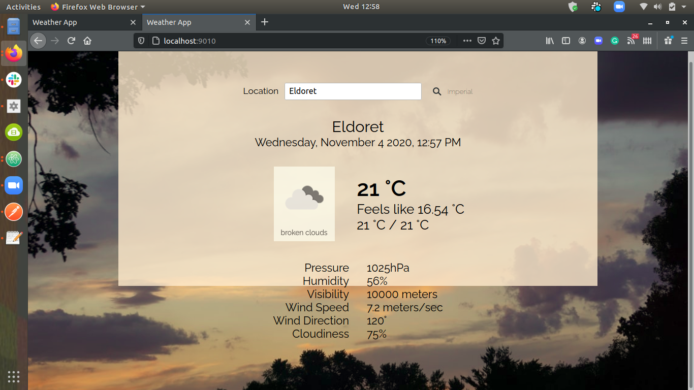

# JS-Weather-App
Weather forecast site using the weather API.
Search for a specific location and toggle displaying the data in Fahrenheit or Celsius.

## Built With

- HTML, CSS and JavaScript
- OpenWeatherMap API
- Unsplash API

## Live Demo

## Getting Started

- Clone this [repository](https://github.com/kiptubei/JS-Weather-App/tree/features).
- Switch to the `features` branch.
- Install all dependencies by running `npm install`.
- Launch the project locally by running `npm run dev`.
- Enter the name of the town whose weather you want and search
- Click on Imperial or Metric to toggle between the units

### Usage

- Enter the name of the location in the search bar.
- Click on the _metric_ button next to the search bar, that says `Imperial` (to switch to Imperial units) or `Metric` (to switch to metric units).

## Authors

👤 **Mark James Kiptubei**

- Github: [@kiptubei](https://github.com/kiptubei)
- Twitter: [@mjabei](https://twitter.com/mjabei)
- Linkedin: [Mark James Kiptubei](https://www.linkedin.com/in/kiptubei/)

## 🤝 Contributing

Contributions and feature requests are welcome!

Start by:

- Forking the project
- Cloning the project to your local machine
- `cd` into the project directory
- Run `git checkout -b your-branch-name`
- Make your contributions
- Push your branch up to your forked repository
- Open a Pull Request with a detailed description to the development(or master if not available) branch of the original project for a review

## Show your support

Give a ⭐️ if you like this project!

## Acknowledgments
